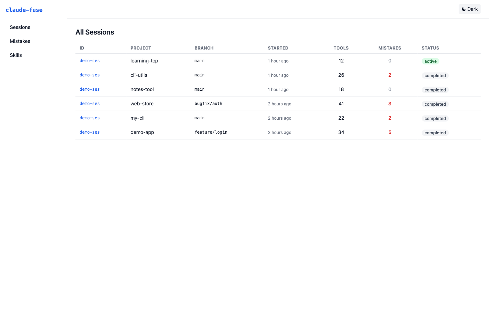
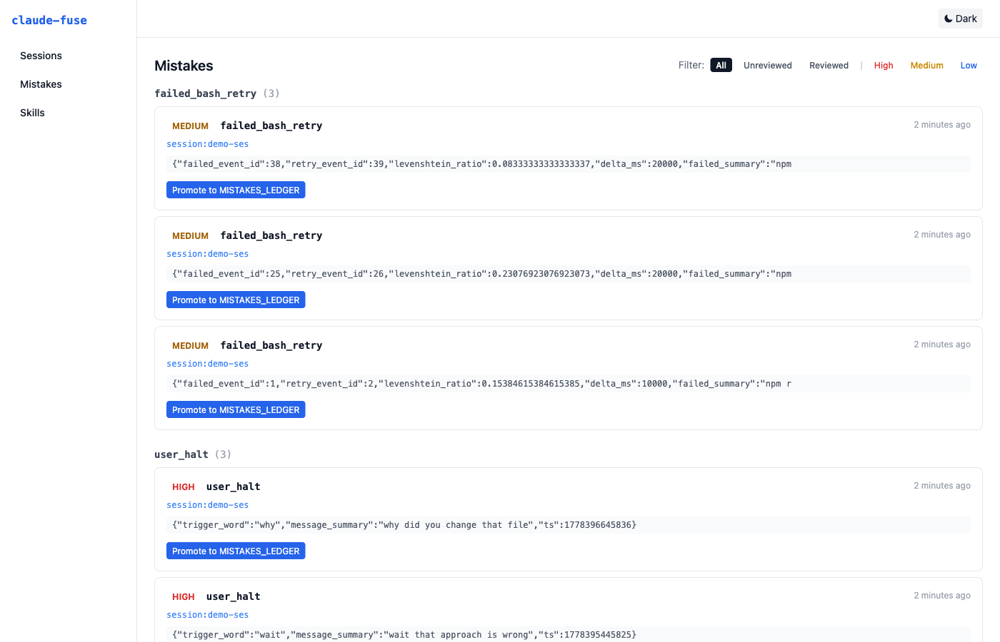
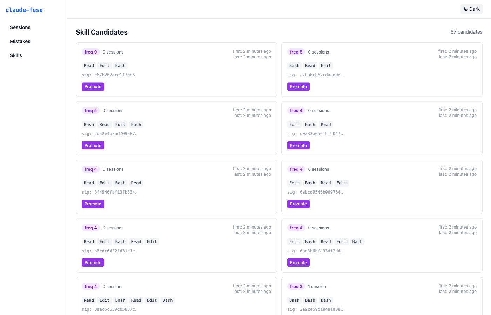
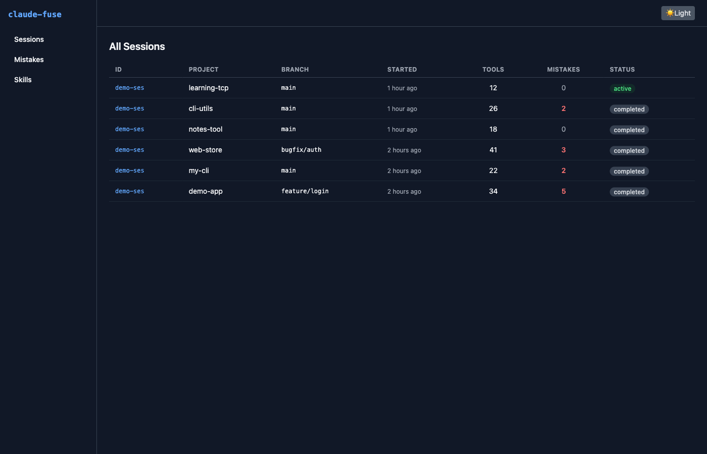
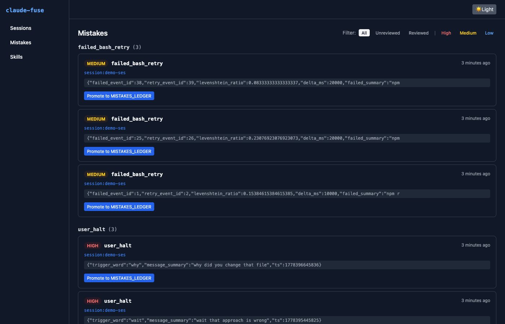

# claude-fuse

> Local-first observability for Claude Code sessions — auto-detects mistakes, surfaces repeated skills.

[](https://github.com/sbkolate/claude-fuse/actions/workflows/ci.yml)
[](LICENSE)
[](#install)



---

## What it does

Langfuse tracks LLM API calls. **claude-fuse tracks entire Claude Code sessions** — every prompt, every tool call, every file edit, every outcome — and runs detectors over the stream to catch mistake patterns you'd otherwise have to notice manually.

Two tracks:

1. **Mistake auto-detection** — 5 patterns: failed bash retries, edit rollbacks, panic resets, user halt interrupts, repeated reads. Promote any detection to your team's [`MISTAKES_LEDGER.md`](https://github.com/sbkolate/claude-fuse#promote-to-ledger) with one click.
2. **Skill discovery** — n-grams over tool sequences flag repeated patterns (e.g. `Read → Edit → Bash` × 246 times) as candidate skills worth turning into reusable templates.

Single-user, local-only, no auth, no telemetry. Your sessions never leave your machine.

---

## Screenshots

| Mistakes feed (light) | Skills (light) |
|---|---|
|  |  |

| Sessions (dark) | Mistakes (dark) |
|---|---|
|  |  |

---

## Install

```bash
git clone https://github.com/sbknext/claude-fuse.git
cd claude-fuse
cp .env.example .env
npm run setup
```

`npm run setup` runs `npm install`, creates `data/metadata.db`, and prints the next step.

Requires Node 20+. SQLite ships with `better-sqlite3`, no separate install.

## Run

```bash
npm start                  # api :5457 + dashboard :5460, coloured prefixes
npm run backfill -- --since 30d
open http://localhost:5460
```

**Manual mode** (if you prefer separate terminals):

```bash
npm run dev:api &          # api on http://localhost:5457
npm run dev:dashboard &    # dashboard on http://localhost:5460
npm run backfill -- --since 30d
```

The first time you run `backfill` it scans `~/.claude/projects/*.jsonl` (where Claude Code persists every session) and ingests everything since the cutoff. On a typical week of usage that's ~10k events in a few seconds.

## Live capture (optional)

```bash
node collector/bin/claude-fuse-collector.js install
```

This **merges** four hooks into your existing `~/.claude/settings.json` — `PreToolUse`, `PostToolUse`, `UserPromptSubmit`, `Stop`. Idempotent, backed up on first install, never clobbers your own hooks. Each hook fires fire-and-forget POSTs to the api with a 500 ms timeout, queues locally if the api is down, and never blocks Claude Code.

To remove: `node collector/bin/claude-fuse-collector.js uninstall`.

See [`docs/HOOKS_SETUP.md`](docs/HOOKS_SETUP.md) for details.

---

## Detection patterns

| Pattern | Trigger | Severity |
|---|---|---|
| `failed_bash_retry` | Bash exits ≠0, then a near-identical Bash within 60 s (Levenshtein < 0.3) | medium |
| `edit_rollback` | Edit on file X, then another Edit on X within 120 s reverting >50% of the prior change | medium |
| `user_halt` | User issued a halt/why interrupt; matches `stop`, `wait`, `why`, plus Hindi `kyu`, `nahi`, `ruk` (bilingual matching — real feature). Severity: high. | high |
| `panic_reset` | `git reset --hard` or `git checkout .` within 5 min of a recent commit | high |
| `repeated_grep_read` | 3+ Grep/Read calls on the same file within 2 min | low |

Each detector is a pure function in [`api/src/detectors/`](api/src/detectors/) and runs synchronously inside the ingest transaction. To add a new one, see [CONTRIBUTING.md](CONTRIBUTING.md#adding-a-detector).

## Skill discovery

Per session, the analyzer extracts the ordered tool-name sequence and slides 3- to 6-grams over it. Each n-gram is hashed (sha256) into a canonical signature; frequency and distinct-session counts are upserted into `skill_candidates`. Threshold for review: `frequency ≥ 5` AND `distinct sessions ≥ 3`.

Phase 1 is intentionally simple — no embeddings, no semantic clustering. Those land in Phase 2.

## Promote to ledger

Hit **Promote** on any mistake row and claude-fuse appends a templated entry to the file pointed at by `CLAUDE_FUSE_LEDGER_PATH` (defaults to `../MISTAKES_LEDGER.md`). It auto-increments the next M-number by grepping `^## M(\d+)` headers. Marks the mistake `reviewed=1` and stores `ledger_entry_id` for back-reference.

---

## Architecture

```
JSONL (~/.claude/projects/*) ──┐ via collector
~/.claude/settings.json hooks  │
                               ▼
                        api :5457 (Express + better-sqlite3)
                               │
            ┌──────────────────┼──────────────────┐
            ▼                  ▼                  ▼
       SQLite metadata   raw JSONL on disk   5 detectors + n-gram
                               │
                               ▼
                       dashboard :5460 (Next.js 15)
```

Three workspaces, hard-bounded — none import from another:

| Workspace | Stack | Purpose |
|---|---|---|
| [`api/`](api/) | Express, better-sqlite3, vitest | ingest, schema, detectors, n-gram, promote |
| [`collector/`](collector/) | Node CLIs, vitest | JSONL parser, backfill, hook installer, queue |
| [`dashboard/`](dashboard/) | Next.js 15, Tailwind v3, vitest + RTL | sessions / mistakes / skills views |

Storage is hybrid by design: SQLite for fast queries (`mistake_count > 0 last week` in <10 ms over 10k rows), raw JSONL on disk for full payload preservation, linked via `events.jsonl_offset`.

Full diagram + storage rationale: [`docs/ARCHITECTURE.md`](docs/ARCHITECTURE.md).

---

## Tech stack

- **Runtime:** Node 20+
- **API:** Express, [better-sqlite3](https://github.com/WiseLibs/better-sqlite3), [fastest-levenshtein](https://github.com/ka-weihe/fastest-levenshtein), dotenv, supertest
- **Collector:** native `fetch`, [commander](https://github.com/tj/commander.js), streaming `readline`
- **Dashboard:** Next.js 15 (App Router), React 19, TypeScript, Tailwind v3, [@testing-library/react](https://testing-library.com/)
- **Tests:** [vitest](https://vitest.dev/) across all 3 workspaces
- **Workspaces:** npm workspaces (no pnpm/yarn dependency)

Coverage on the parts that matter (Phase 1 release):
- `api/src/detectors/` — 100% statements, 100% functions
- `api/src/analyzers/` — 98% statements
- `collector/src/jsonl-parser.js` — 91% statements
- `collector/src/installer.js` — 92% statements

## Project layout

```
claude-fuse/
├── api/             Express + SQLite, ingest + detectors + n-gram
├── collector/       JSONL parser, backfill CLI, hook installer
├── dashboard/       Next.js 15 dashboard
├── docs/            ARCHITECTURE, HOOKS_SETUP, BACKFILL_GUIDE, screenshots
├── data/            SQLite db + raw JSONL (gitignored)
└── .github/         CI workflow, issue / PR templates
```

---

## Roadmap

### Phase 1 (shipped)
- ✅ JSONL backfill + live hook capture
- ✅ Hybrid SQLite + on-disk storage
- ✅ 5 detectors
- ✅ N-gram skill discovery
- ✅ Dashboard with promote-to-ledger
- ✅ Single user, local only

### Phase 2 (next)
- Embeddings + semantic skill clustering
- Ingest dedup via JSONL checksum
- ✅ Cost dashboard (per-session, per-day, per-project) — shipped in 1.5.7
- Project-name normaliser

### Phase 3+
- Multi-user auth
- Langfuse cross-link
- Session replay timeline scrubber
- Team observability mode
- Optional remote deploy recipe

---

## Why claude-fuse exists

I run a lot of Claude Code sessions across several repos. After the third time I caught myself making the same mistake — `git reset --hard` on a branch I cared about, repeated grep loops because I lost context, edits I rolled back five minutes later — I started a manual `MISTAKES_LEDGER.md`. Thirty-two entries in, it was clear the patterns were *programmatic*. claude-fuse is the result: let the machine watch for the patterns the ledger documents, surface them in a feed, and let me promote the real ones with one click.

The skill side is the inverse: the same five-tool sequence run thirty times across ten sessions is begging to be a slash command or a documented playbook. Surface those too.

Phase 1 is local-only on purpose. The session JSONL is mine; observability tooling shouldn't ship it off-machine without consent.

---

## Comparison

| | claude-fuse | Langfuse | Helicone |
|---|---|---|---|
| **Scope** | Claude Code sessions — prompts, tool calls, file edits, outcomes | LLM API calls — requests, responses, token counts | LLM API calls — requests, costs, latency |
| **Where data goes** | Local only (`data/metadata.db`, no account needed) | Self-host or Langfuse Cloud | Helicone Cloud (self-host available) |
| **Install** | `npm start` after clone, no account | SDK wrapper + project key | Proxy or SDK wrapper + API key |

These tools solve different problems. Langfuse and Helicone are production observability for AI applications; claude-fuse is developer-workflow observability for the Claude Code loop. They're complementary — Phase 3 includes a Langfuse cross-link.

---

## FAQ

Full answers in [`docs/FAQ.md`](docs/FAQ.md). Quick teasers:

**How is this different from Langfuse / Helicone?**
Langfuse/Helicone instrument LLM API calls. claude-fuse instruments the Claude Code developer workflow — tool calls, file edits, interventions, session patterns. Different substrate, complementary use cases.

**Does my session data leave my machine?**
No. Local only. No accounts, no telemetry, no external endpoints.

---

## Troubleshooting

Full guide in [`docs/TROUBLESHOOTING.md`](docs/TROUBLESHOOTING.md). Three most common issues:

- **Port 5457/5460 in use** — `lsof -i :5457` to find the process; override via `CLAUDE_FUSE_API_PORT`.
- **Backfill reports 0 events** — run `ls ~/.claude/projects/` to confirm the directory exists and has JSONL files.
- **Dashboard empty after backfill** — check `NEXT_PUBLIC_CLAUDE_FUSE_API_URL` in `dashboard/.env.local` and verify `curl http://localhost:5457/sessions` returns data.

Questions not covered? [GitHub Discussions](https://github.com/sbknext/claude-fuse/discussions).

---

## Contributing

PRs welcome. See [CONTRIBUTING.md](CONTRIBUTING.md) for setup and the workspace boundary rule. Bug reports use `.github/ISSUE_TEMPLATE/bug_report.md`.

## Acknowledgements

Built on top of [Claude Code](https://docs.claude.ai/en/docs/claude-code/overview) — the agentic coding tool that generates the session JSONL files claude-fuse analyses. The hook system (`PreToolUse`, `PostToolUse`, `UserPromptSubmit`, `Stop`) is a first-class Claude Code feature.

## License

[MIT](LICENSE) © 2026 Sambhaji Kolate
